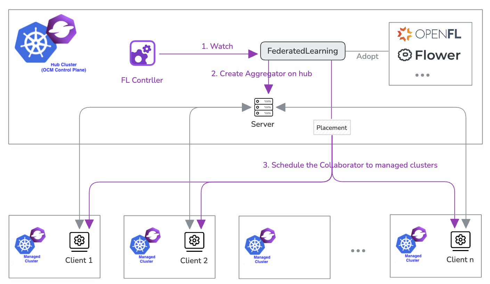

# Federated Learning Controller for Open Cluster Management

This Kubernetes controller automates the deployment and management of federated learning in an Open Cluster Management environment. The `FederatedLearning` Custom Resource Definition (CRD) provides a unified open interface for integrating frameworks such as Flower, OpenFL, and NVIDIA FLARE. It leverages Kubernetes-native resources to provision servers, launch clients, and orchestrate the training lifecycle across a multicluster environment.



---

## Bring Federated Learning Across Multiple Clusters

This controller enables federated learning across a **multicluster environment** without the need for manual orchestration. The only requirement is to **containerize your workload**, making it compatible with different federated learning frameworks.  

The controller reconciles `FederatedLearning` instances, managing the lifecycle of **server** and **client** components that handle model training and aggregation. To integrate with the provided interface, servers and clients should follow the expected startup patterns.  

For example, see: [Flower PyTorch App](./examples/flower/Makefile)

- **Server**

  Creates a Kubernetes Job using a built-in manifest template, expected to start with:

  ```bash
  server --num-rounds <number-of-rounds> ...
  ```

- **Client**  

  Creates a Kubernetes Job via **ManifestWorks** from the hub cluster, expected to start with: 

  ```bash
  client --data-config <data-configuration> --server-address <aggregator-address> ...
  ```

--- 

## Getting Started

### Running Locally

**Install the CRDs into the cluster:**

```sh
make install
```

**Run the controller locally:**

```sh
make run
```

### To Deploy on the cluster

**1. Build and push your image to the location specified by `IMG`:**
```sh
make docker-build docker-push IMG=
# or
make docker-build docker-push REGISTRY=<REGISTRY> 
```
**NOTE:** This image ought to be published in the personal registry you specified.
And it is required to have access to pull the image from the working environment.
Make sure you have the proper permission to the registry if the above commands don’t work.


**2. Deploy the Controller to the cluster**

```sh
make deploy IMG=<some-registry>/controller:tag NAMESPACE=<namespace>
```

> **NOTE**: If you encounter RBAC errors, you may need to grant yourself cluster-admin
privileges or be logged in as admin.

**3. Create a FederatedLearning instance**

```yaml
apiVersion: federation-ai.open-cluster-management.io/v1alpha1
kind: FederatedLearning
metadata:
  name: federated-learning-sample
spec:
  framework: flower
  server:
    image: quay.io/open-cluster-management/flower-app-torch:latest
    rounds: 3
    minAvailableClients: 2
    listeners:
      - name: server-listener
        port: 8080
        type: LoadBalancer
    storage:
      type: PersistentVolumeClaim
      name: model-pvc
      path: /data/models
      size: 2Gi
  client:
    image: quay.io/open-cluster-management/flower-app-torch:latest
    placement:
      clusterSets:
        - global
      predicates:
        - requiredClusterSelector:
            claimSelector:
              matchExpressions:
                - key: federated-learning-sample.client-data
                  operator: Exists
```
**Note:** You can replace the above server and client images with those from your own registry.

**4. Mark the data from the Managed clusters**

```sh
cat <<EOF | oc apply -f -
apiVersion: cluster.open-cluster-management.io/v1alpha1
kind: ClusterClaim
metadata:
  name: federated-learning-sample.client-data
spec:
  value: /data/private/cluster1
EOF
```

## Model Validation

- Validate the model from the pvc by the guide in the [notebook](./examples/notebooks/deploy)

### To Uninstall
**Delete the instances (CRs) from the cluster:**

```sh
kubectl delete -k config/samples/
```

**Delete the APIs(CRDs) from the cluster:**

```sh
make uninstall
```

**UnDeploy the controller from the cluster:**

```sh
make undeploy
```

## Project Distribution

Following are the steps to build the installer and distribute this project to users.

1. Build the installer for the image built and published in the registry:

```sh
make build-installer IMG=<some-registry>/controller:tag
```

NOTE: The makefile target mentioned above generates an 'install.yaml'
file in the dist directory. This file contains all the resources built
with Kustomize, which are necessary to install this project without
its dependencies.

2. Using the installer

Users can just run kubectl apply -f <URL for YAML BUNDLE> to install the project, i.e.:

```sh
kubectl apply -f https://raw.githubusercontent.com/<org>/github/open-cluster-management/federated-learning/<tag or branch>/dist/install.yaml
```